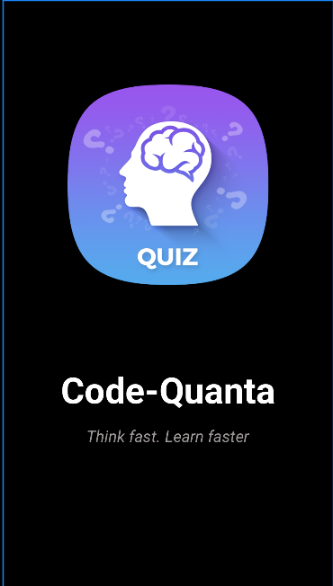
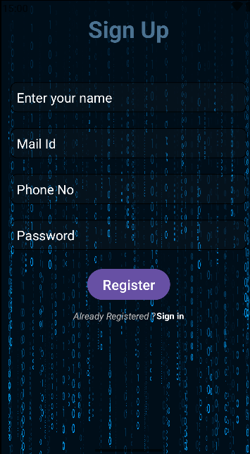
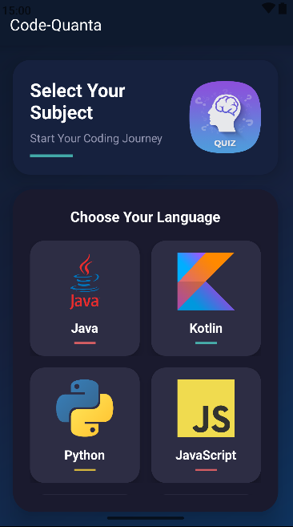
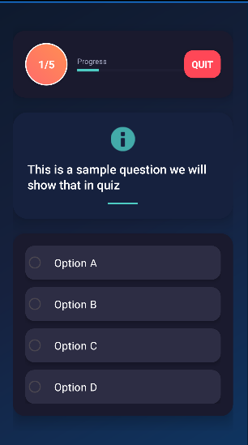
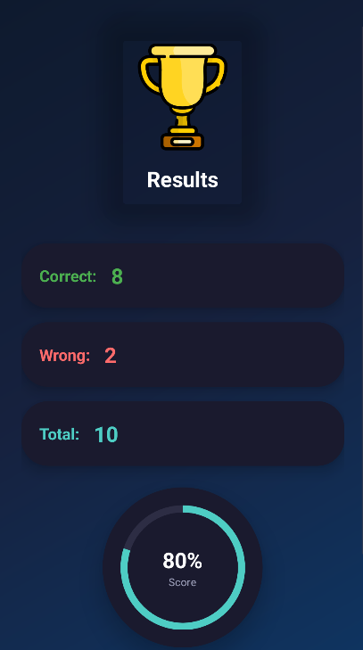
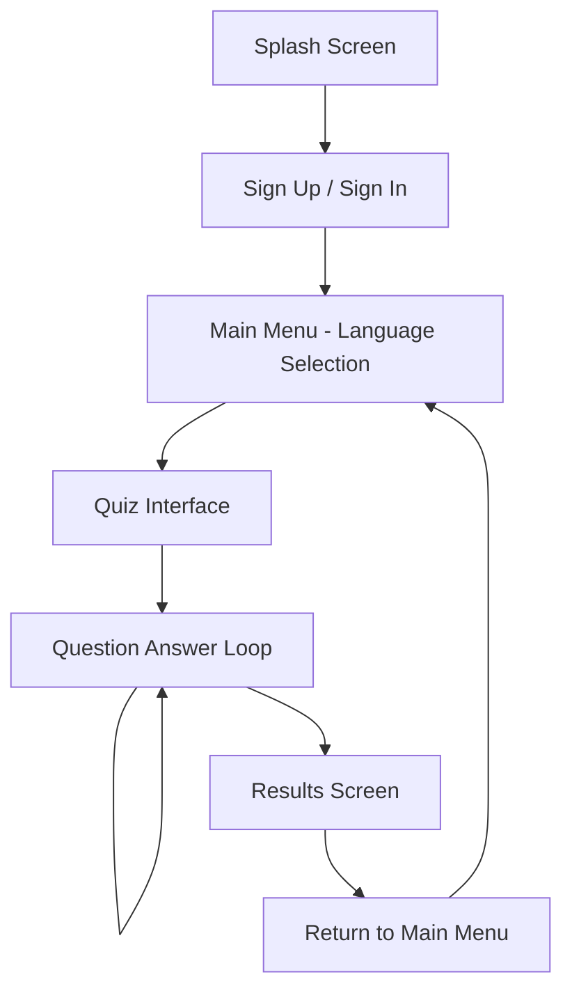

# 🧠 Code-Quanta

<div align="center">
  
  
  
  
</div>

<div align="center">
  <h3>🎯 Test Your Programming Knowledge Across Multiple Languages</h3>
  <p><em>An interactive Android quiz application designed to challenge and enhance your coding skills</em></p>
</div>

---

## 📱 About Code-Quanta

**Code-Quanta** is a modern Android educational app that transforms learning programming concepts into an engaging quiz experience. Whether you're a beginner looking to test your knowledge or an experienced developer wanting to refresh your skills, Code-Quanta offers a comprehensive platform to evaluate your understanding across multiple programming languages.

### 🌟 Key Features

| Feature | Description |
|---------|-------------|
| 🔐 **Secure Authentication** | Firebase-powered email/password authentication |
| 📊 **Real-time Scoring** | Instant feedback with detailed score tracking |
| 🎨 **Modern UI/UX** | Material Design 3 with smooth animations |
| 🔥 **Cloud Integration** | Firestore database for seamless data sync |
| 📱 **Edge-to-Edge Design** | Optimized for modern Android devices |
| ✨ **Smooth Animations** | Engaging transitions and visual feedback |

### 🚀 Supported Programming Languages

- ☕ **Java** - Object-oriented programming fundamentals
- 🔷 **Kotlin** - Modern Android development *(Coming Soon)*
- 🐍 **Python** - Data science and scripting *(Coming Soon)*
- 💛 **JavaScript** - Web development essentials *(Coming Soon)*
- ⚡ **C** - System programming basics *(Coming Soon)*
- 🔧 **C++** - Advanced programming concepts *(Coming Soon)*
- 🎯 **Dart** - Flutter development *(Coming Soon)*

---

## 📸 Screenshots

<div align="center">  
  
  
  
  
</div>

> *Screenshots showcase the modern Material Design interface and smooth user experience*

---

## 🏗️ Technical Architecture

### **Core Technologies**
- **Platform**: Native Android (API 29+)
- **Language**: Java 11
- **Build System**: Gradle with Kotlin DSL
- **Architecture**: MVVM Pattern *(Planned)*

### **Backend Services**
- **Authentication**: Firebase Auth
- **Database**: Cloud Firestore
- **Storage**: Firebase Cloud Storage
- **Analytics**: Firebase Analytics *(Planned)*

### **UI/UX Libraries**
- **Design**: Material Design Components
- **Progress Indicators**: CircularProgressBar
- **Animations**: Android Transition Framework
- **Layout**: ConstraintLayout

---

## 🚀 Quick Start

### Prerequisites
- **Android Studio** (Latest stable version)
- **JDK 11+** configured with JAVA_HOME
- **Firebase Project** with Authentication enabled

### 1️⃣ Clone the Repository
```bash
git clone https://github.com/your-username/Code-Quanta.git
cd Code-Quanta
```

### 2️⃣ Firebase Setup
1. Create a new project at [Firebase Console](https://console.firebase.google.com/)
2. Enable **Authentication** (Email/Password method)
3. Create a **Firestore Database**
4. Download `google-services.json` and place it in the `app/` directory

### 3️⃣ Build & Run
```bash
# Clean and build the project
./gradlew clean build

# Install debug APK on connected device
./gradlew installDebug
```

### 4️⃣ Open in Android Studio
1. Open Android Studio
2. Select "Open an Existing Project"
3. Navigate to the cloned repository
4. Wait for Gradle sync to complete
5. Run the app on your device or emulator

---

## 🎮 How to Use

### **Getting Started**
1. **Launch** the app and enjoy the animated splash screen
2. **Sign Up** for a new account or **Sign In** with existing credentials
3. **Choose** a programming language from the main menu
4. **Answer** quiz questions and receive instant feedback
5. **View** your results and track your progress

### **Quiz Features**
- ✅ Multiple choice questions with immediate feedback
- 📊 Real-time score calculation
- 🎯 Correct answer explanations for wrong responses
- ⏱️ Progress tracking throughout the quiz

---

## 🏆 App Flow



---

## 📁 Project Structure

```
Code-Quanta/
├── 📱 app/
│   ├── 🔧 src/main/
│   │   ├── 📦 java/com/Archis/code_quanta/
│   │   │   ├── 🏠 MainActivity.java          # Language selection hub
│   │   │   ├── ✨ SplashScreen.java         # Animated app intro
│   │   │   ├── 🔐 SignIn.java               # User authentication
│   │   │   ├── 📝 SignUp.java               # User registration
│   │   │   ├── ❓ QuestionActivity.java     # Interactive quiz interface
│   │   │   └── 📊 ResultActivity.java       # Score display & analytics
│   │   ├── 🎨 res/
│   │   │   ├── layout/                      # XML UI layouts
│   │   │   ├── drawable/                    # Graphics & icons
│   │   │   ├── anim/                        # Animation resources
│   │   │   └── values/                      # Strings, colors, styles
│   │   └── 📋 AndroidManifest.xml
│   ├── ⚙️ build.gradle.kts                  # Module dependencies
│   └── 🔥 google-services.json             # Firebase configuration
├── 🔨 build.gradle.kts                      # Project build script
├── ⚙️ gradle.properties                     # Gradle settings
└── 📝 settings.gradle.kts                   # Project configuration
```

---

## 🔧 Configuration

### **Build Configuration**
- **Minimum SDK**: 29 (Android 10.0)
- **Target SDK**: 35 (Android 14)
- **Compile SDK**: 35
- **Java Version**: 11
- **Build Tools**: Gradle 8.10.1

### **Firebase Configuration**
```json
{
  "project_info": {
    "project_id": "your-project-id",
    "firebase_url": "https://your-project.firebaseio.com"
  }
}
```

---

## 🧪 Testing

### **Run Unit Tests**
```bash
./gradlew test
```

### **Run Instrumented Tests**
```bash
./gradlew connectedAndroidTest
```

### **Generate Test Reports**
```bash
./gradlew testDebugUnitTest --info
```

---

## 📦 Build & Deploy

### **Debug Build**
```bash
./gradlew assembleDebug
```

### **Release Build**
```bash
./gradlew assembleRelease
```

### **Generate App Bundle (Recommended)**
```bash
./gradlew bundleRelease
```

---

## 🔮 Roadmap & Future Enhancements

### **Phase 1: Core Features** ✅
- [x] Firebase Authentication
- [x] Java Quiz Questions
- [x] Score Tracking
- [x] Modern UI Design

### **Phase 2: Enhanced Experience** 🚧
- [ ] Multiple Programming Languages
- [ ] Difficulty Levels (Beginner, Intermediate, Advanced)
- [ ] Timer-based Challenges
- [ ] Offline Mode Support

### **Phase 3: Social Features** 📋
- [ ] Global Leaderboards
- [ ] Achievement System
- [ ] Progress Sharing
- [ ] Community Challenges

### **Phase 4: Advanced Features** 🔮
- [ ] AI-powered Question Generation
- [ ] Personalized Learning Paths
- [ ] Code Snippet Questions
- [ ] Dark Mode Support

---

## 🤝 Contributing

We welcome contributions from the community! Here's how you can help:

### **Getting Started**
1. 🍴 Fork the repository
2. 🌟 Create a feature branch (`git checkout -b feature/AmazingFeature`)
3. 💻 Make your changes
4. ✅ Test thoroughly
5. 📝 Commit your changes (`git commit -m 'Add some AmazingFeature'`)
6. 🚀 Push to the branch (`git push origin feature/AmazingFeature`)
7. 🔄 Open a Pull Request

### **Contribution Guidelines**
- Follow Android coding conventions
- Add unit tests for new features
- Update documentation as needed
- Ensure all tests pass before submitting

---

## 🐛 Issues & Support

### **Reporting Issues**
If you encounter any bugs or have feature requests, please:
1. Check [existing issues](https://github.com/your-username/Code-Quanta/issues)
2. Create a [new issue](https://github.com/your-username/Code-Quanta/issues/new) with detailed description
3. Include steps to reproduce (for bugs)

### **Getting Help**
- 📖 Check the [Project Setup Guide](PROJECT_SETUP.md)
- 💬 Join our community discussions
- 📧 Contact the maintainers

---

## 📄 License

This project is licensed under the MIT License - see the [LICENSE](LICENSE) file for details.

---

## 👨‍💻 Author

**Archis** - *Initial work and development*

- 📧 Email: [your-email@example.com]
- 🐙 GitHub: [@your-username](https://github.com/your-username)
- 💼 LinkedIn: [Your LinkedIn Profile](https://linkedin.com/in/your-profile)

---

## 🙏 Acknowledgments

- 🔥 **Firebase Team** for excellent backend services
- 🎨 **Material Design Team** for beautiful UI components
- 📚 **Android Development Community** for inspiration and support
- 🌟 **Contributors** who help improve Code-Quanta

---

<div align="center">
  <h3>⭐ Star this repo if you find it helpful!</h3>
  <p>
    <a href="https://github.com/your-username/Code-Quanta/stargazers">
      
    </a>
    <a href="https://github.com/your-username/Code-Quanta/network/members">
      
    </a>
  </p>
</div>

---

<div align="center">
  <p><strong>Made with ❤️ for the Programming Community</strong></p>
  <p><em>Happy Coding! 🎉</em></p>
</div>
